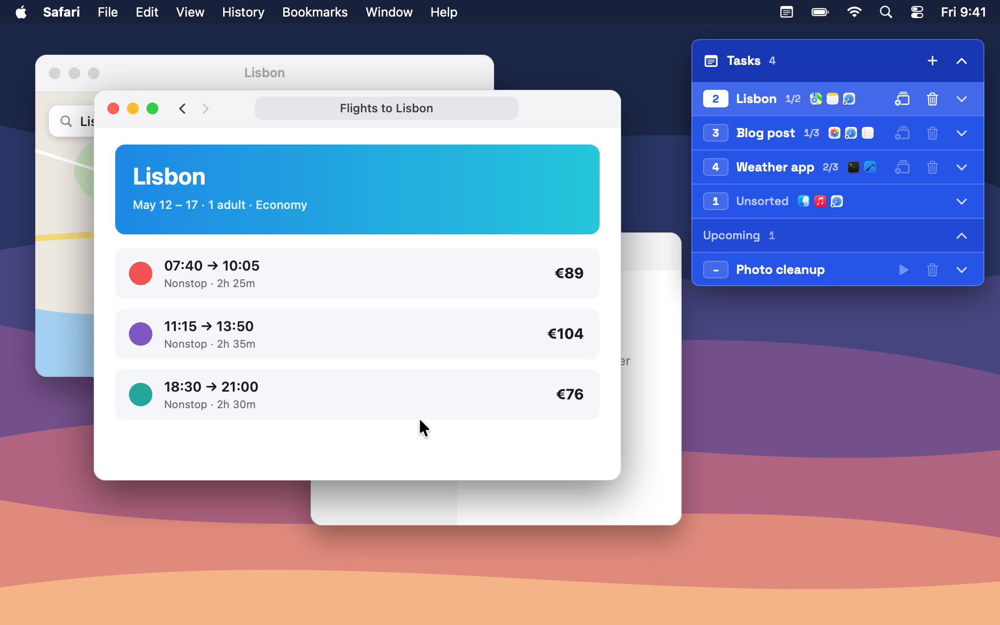

# Desks

A floating task panel for macOS where every task gets its own real desktop.

Keep a short list of what you are working on in the top-right corner of the screen. Each task owns a Mission Control desktop, so switching tasks switches desktops, and each task shows the windows that live on it.



## Features

- **A desktop per task.** Creating a task adds a new desktop and takes you there. Desktop 1 stays home for unsorted windows.
- **Upcoming tasks.** Press `⌘↩` instead of `↩` to save a task for later without a desktop, then start it when you are ready.
- **Descriptions and to-dos.** Jot down what the task is about and keep a checklist. `↩` adds a to-do or moves to the next one, `↑`/`↓` move between them, and `⌘↩` checks or unchecks one and moves on. Click **To-dos** to tuck a long list away; collapsed tasks and lists show how many are done.
- **Live window lists.** See which windows sit on each task's desktop and click one to jump to it.
- **Switch fast.** Click a task, or use the macOS `⌃1`–`⌃9` desktop shortcuts shown on each task.
- **Organize.** Drag a task by its name to reorder it; the others slide out of the way. Double-click a name to rename it, and hover a long name to scroll the rest into view.
- **Move windows.** Drag any window by its title bar onto a task in the panel, drag a window's row onto a task, right-click it and choose **Send to**, or send the front window to a task with one click. The window comes to the front on its new desktop and keeps its size and place, scaled to fit when it moves to another screen.
- **Coding-agent conversations.** Link conversations from Claude Code in the Claude app, Codex, Devin, and the VS Code Agents window to a task. Conversations that aren't linked yet wait in an unsorted list for each app; drag one onto a task to link it. Clicking a linked conversation brings the app's window to the task's desktop and opens that conversation; clicking an unlinked one takes you to the desktop where the app is. Each conversation shows whether it is working, needs you, or is done. See [Coding agents](#coding-agents).
- **Multiple displays.** Desktops on every screen are listed and switched correctly. Move a task to another screen from its right-click menu. When a screen is unplugged, its tasks move to the built-in screen and return when it is plugged back in.
- **Stays out of the way.** Tasks collapse to a single line with app icons, the panel sizes itself to its content, and it snaps back to the corner after you move it. It steps below notification banners and returns when they leave.
- **Gestures from anywhere.** Double-tap `⌃` to tuck the panel into the screen edge (hover the edge to peek at it), or double-tap and hold `⌃` to see through it. Double-tap `⌥` to fold the to-dos or task under the pointer, or the whole panel when the pointer is elsewhere. Clicking the header also folds the panel.

## Requirements

- macOS 14 or later (developed on macOS 26)
- Xcode or the Swift command line tools (Swift 5.9+)
- Accessibility permission for Desks

## Build and run

```bash
./build.sh
```

The script builds a release binary, bundles `Desks.app`, signs it (with your Apple Development certificate if one is installed, otherwise ad hoc), installs it to `~/Applications`, and launches it.

On first launch, allow Desks under **System Settings → Privacy & Security → Accessibility**.

For instant switching, turn on **Switch to Desktop 1–9** under **System Settings → Keyboard → Keyboard Shortcuts → Mission Control**. Without them, Desks switches through Mission Control instead.

## Coding agents

Coding-agent support is off until you choose **Connect Coding Agents** from the Desks menu bar icon. Desks then adds hook entries for each agent it finds:

| Agent | File |
|---|---|
| Claude Code in the Claude app | `~/.claude/settings.json` |
| Codex (app and CLI) | `~/.codex/hooks.json` |
| Devin | `~/.config/devin/config.json` |
| VS Code Agents window (GitHub Copilot) | `~/.copilot/hooks/desks.json` |

Your existing entries and formatting are kept, and each file is copied to `<file>.desks-backup` before its first change. Codex runs new hooks only after you approve them with `/hooks`.

Each hook runs a small script that records the app, session ID, event name, working folder, and time in `~/Library/Application Support/Desks/events/`. Prompts and replies are never recorded. Titles come from each app's own local session data. **Disconnect Coding Agents** removes the entries, the script, and the recorded events.

A conversation appears after its next prompt and leaves the unsorted list 24 hours after its last activity. Not supported yet: agent CLIs running in a terminal, Claude chats (only Claude Code sessions), and cloud sessions.

## How it works

macOS has no public API for desktops, so Desks combines a few techniques that do not require disabling System Integrity Protection:

- It reads desktops and their windows through private SkyLight functions.
- It moves a window to another desktop with SkyLight's bridged window-management operation, which works on any app's window without switching desktops. If that is unavailable it falls back to reassigning a single-window app, then to dragging the window's thumbnail in Mission Control.
- It adds, removes, and switches desktops through Mission Control and the desktop shortcuts, so the Dock always knows about every desktop. Moving a task to another screen makes a desktop there, moves the windows over, and removes the old one.
- It opens a conversation through the app's own link (`claude://`, `codex://`, `devin://`, `vscode://`), after moving the app's window with the same window operation.

Because these rely on private behavior, a macOS update can break them.

Tasks and their linked conversations are stored locally in `~/Library/Application Support/Desks/items.json`. Windows are read live and never stored. Desks makes no network connections.

## License

MIT, see [LICENSE](LICENSE). Space Grotesk is bundled under the SIL Open Font License 1.1, see [Resources/Fonts/OFL.txt](Resources/Fonts/OFL.txt).
