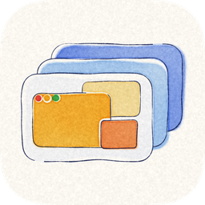
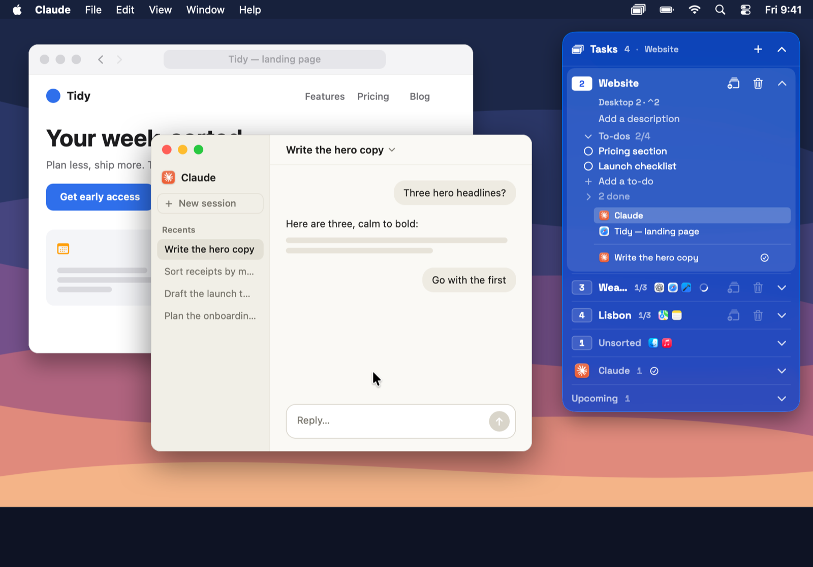
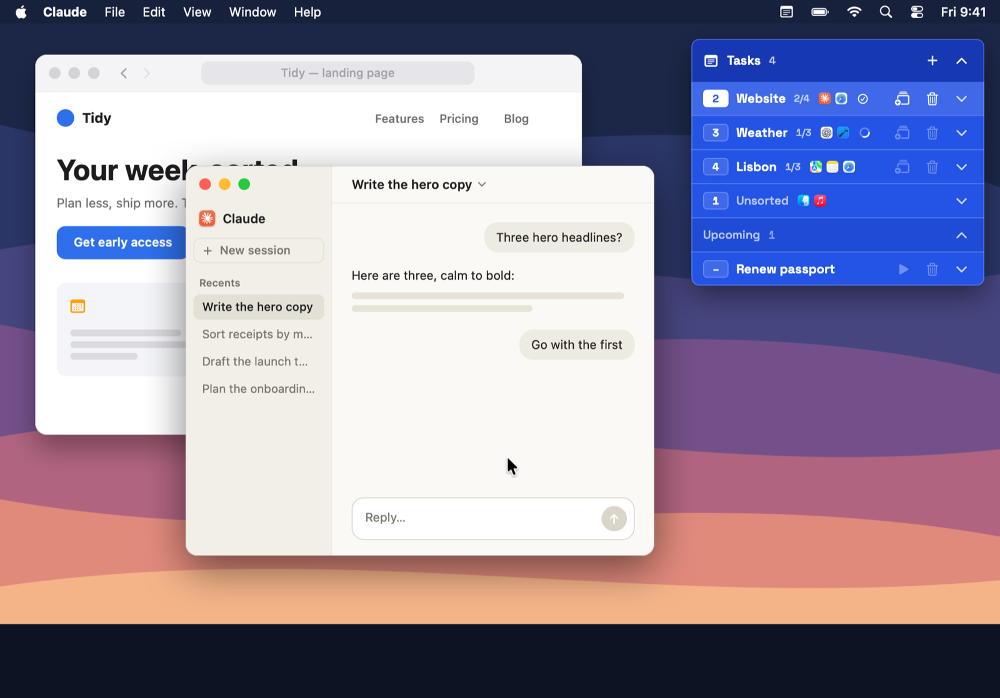
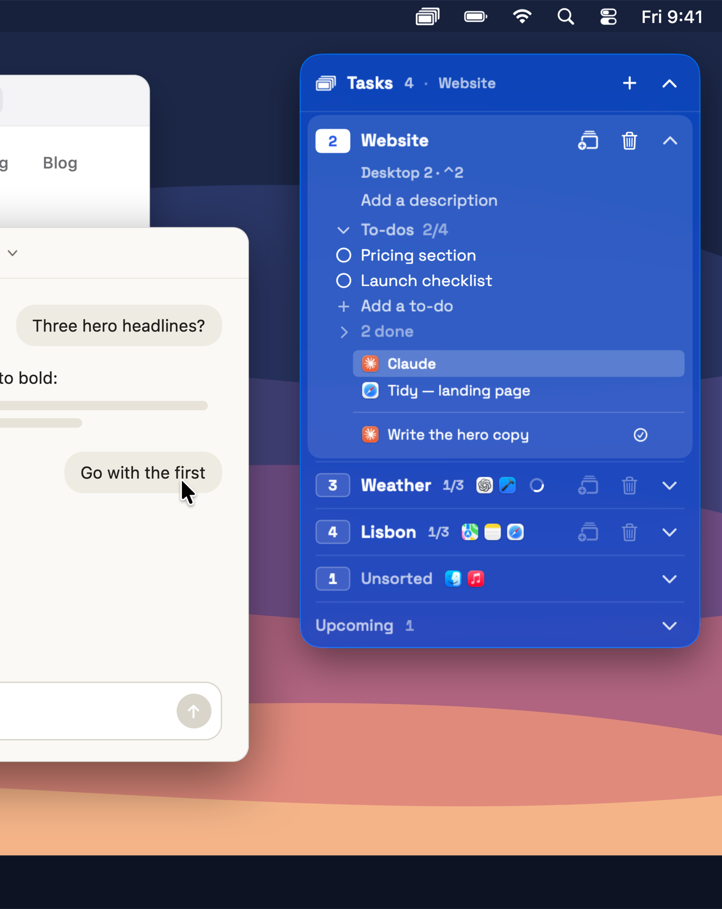
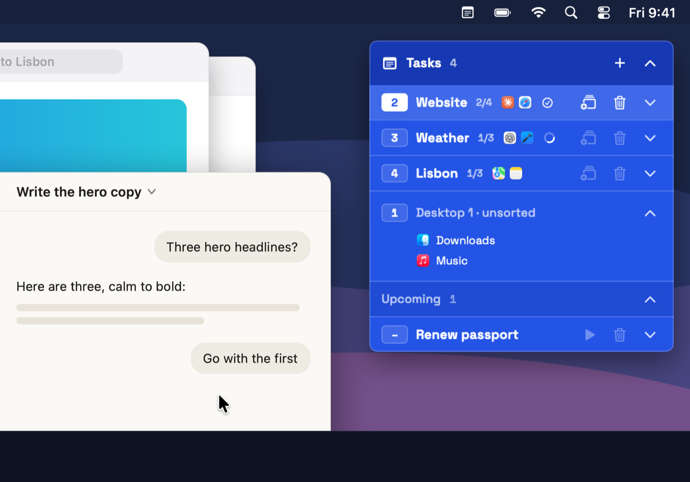
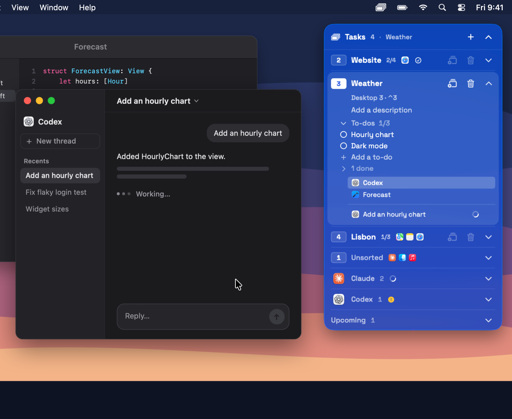
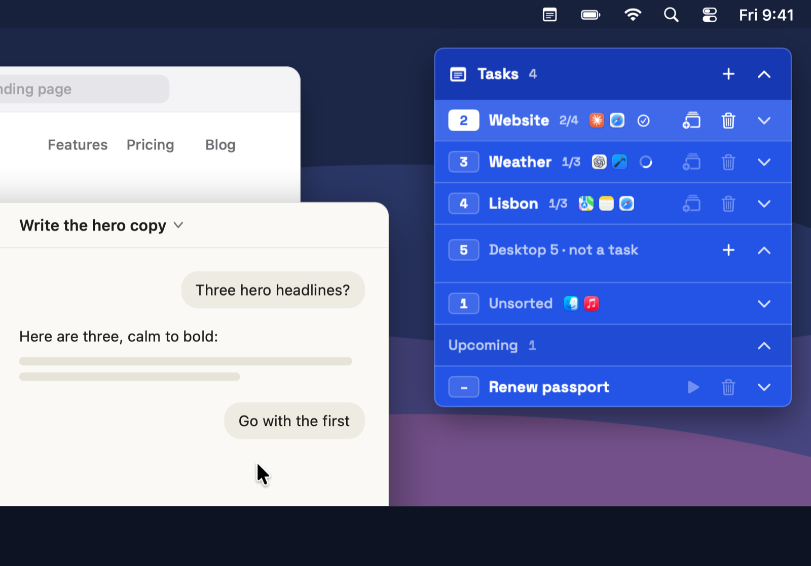
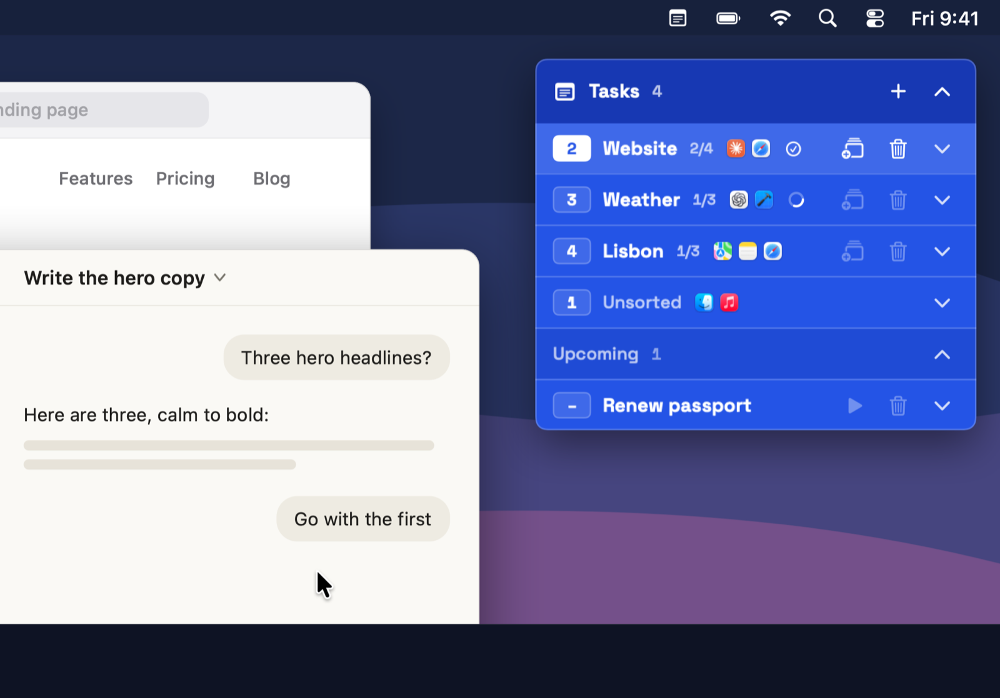
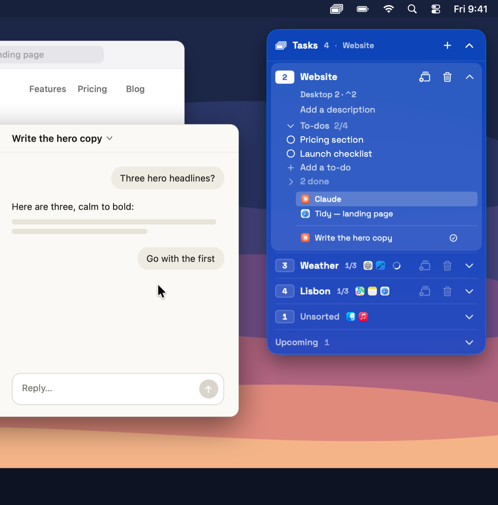

# Desks

A floating task panel for macOS where every task gets its own real desktop.

Keep a short list of what you are working on in the top-right corner of the screen. Each task owns a Mission Control desktop, so switching tasks switches desktops, and each task shows the windows that live on it.



## Features

<table>
<tr>
<td width="50%" valign="top">
<br>
<b>A desktop per task</b><br>
Every task gets its own Mission Control desktop. Desktop 1 stays home for everything else.
</td>
<td width="50%" valign="top">
<br>
<b>Upcoming</b><br>
Save a task for later without a desktop, and start it when you are ready.
</td>
</tr>
<tr>
<td width="50%" valign="top">
<br>
<b>Descriptions and to-dos</b><br>
A note and a checklist on every task. The checklist edits like a list.
</td>
<td width="50%" valign="top">
<br>
<b>Live window lists</b><br>
See which windows are on each task's desktop, and click one to jump to it.
</td>
</tr>
<tr>
<td width="50%" valign="top">
<br>
<b>Switch fast</b><br>
Click a task or press <code>⌃1</code>–<code>⌃9</code>. The notch briefly shows where you landed.
</td>
<td width="50%" valign="top">
<br>
<b>Organize</b><br>
Drag a task to reorder it, and double-click its name to rename it.
</td>
</tr>
<tr>
<td width="50%" valign="top">
<br>
<b>Move windows</b><br>
Drag a window onto a task, use <b>Send to</b>, or bring an app here from <code>⌘Tab</code>.
</td>
<td width="50%" valign="top">
<br>
<b>Coding-agent conversations</b><br>
Conversations from Claude, Codex, Devin and VS Code sort onto their task and show when they need you. See <a href="#coding-agents">Coding agents</a>.
</td>
</tr>
<tr>
<td width="50%" valign="top">
<br>
<b>Multiple displays</b><br>
Move a task and its windows to another screen.
</td>
<td width="50%" valign="top">
<br>
<b>Stays out of the way</b><br>
Only the task you are on stays open; rest the pointer on another to peek inside. The panel steps aside for notifications.
</td>
</tr>
<tr>
<td width="50%" valign="top">
<br>
<b>Gestures from anywhere</b><br>
Tuck the panel into the screen edge, see through it, or fold whatever is under the pointer.
</td>
<td width="50%"></td>
</tr>
</table>

### Shortcuts

| Keys | What it does |
|---|---|
| `↩` in the new-task field | Create the task and its desktop |
| `⌘↩` in the new-task field | Save the task to Upcoming |
| `⌃1`–`⌃9` | Switch desktops (the macOS shortcuts) |
| `⌃` `⌃` | Tuck the panel into the screen edge, or bring it back |
| `⌃` `⌃`, then hold | See through the panel |
| `⌥` `⌥` | Fold the to-dos or task under the pointer, or the whole panel |
| `⌘Tab`, then `Space` before letting go of `⌘` | Bring the highlighted app's window to this desktop |

In a to-do list:

| Keys | What it does |
|---|---|
| `↩` | Add a to-do, or split one at the cursor; on an empty one, end the list |
| `⌫` at the start of a to-do | Join it to the one above |
| `↑` `↓` | Move between to-dos |
| `⌘↩` | Check or uncheck it and move on |
| Drag its circle | Reorder |

### Good to know

- Creating a task reuses an empty spare desktop when there is one. Right-click a desktop that isn't a task to remove it.
- When a screen is unplugged, its tasks move to the built-in screen and return when it is plugged back in.
- Click a peeking task's chevron to keep it open.
- Every task has a button that sends the front window to it.
- Choose **Appearance** from the Desks menu bar icon to switch between blue and clear Liquid Glass.

## Requirements

- macOS 26 or later
- Xcode or the Swift command line tools (Swift 5.9+)
- Accessibility permission for Desks

## Build and run

```bash
./build.sh
```

The script builds a release binary, bundles `Desks.app`, signs it (with your Apple Development certificate if one is installed, otherwise ad hoc), installs it to `~/Applications`, and launches it.

On first launch, allow Desks under **System Settings → Privacy & Security → Accessibility**.

For instant switching, turn on **Switch to Desktop 1–9** under **System Settings → Keyboard → Keyboard Shortcuts → Mission Control**. Without them, Desks switches through Mission Control instead.

## Coding agents

Coding-agent support is off until you choose **Connect Coding Agents** from the Desks menu bar icon. Desks then adds hook entries for each agent it finds:

| Agent | File |
|---|---|
| Claude Code in the Claude app | `~/.claude/settings.json` |
| Codex (app and CLI) | `~/.codex/hooks.json` |
| Devin | `~/.config/devin/config.json` |
| VS Code Agents window (GitHub Copilot) | `~/.copilot/hooks/desks.json` |

Your existing entries and formatting are kept, and each file is copied to `<file>.desks-backup` before its first change. Codex runs new hooks only after you approve them with `/hooks`.

Each hook runs a small script that records the app, session ID, event name, working folder, the program that ran it, and the time in `~/Library/Application Support/Desks/events/`. Prompts and replies are never written there. Titles come from each app's own local session data. **Disconnect Coding Agents** removes the entries, the script, and the recorded events.

Desks sorts a new conversation onto a task by itself. It reads the messages you sent — from the app's own session files, not from the recorded events — and asks a coding agent's own CLI, whichever of Devin, Codex or Claude Code answers, which one task the conversation is work on. Your task names, descriptions and to-dos go with the question, and the answer is one task or none: a conversation that matches nothing stays unsorted, and you can still drag it yourself. The question runs as its own one-shot process, so it never enters the conversation you are having, and Devin's runs against a scratch folder so it leaves nothing in your own history. Unlinking a conversation from a task keeps it off that task for good, but it can still be sorted onto another.

A conversation appears after its next prompt and leaves the unsorted list 24 hours after its last activity, as each app records it. Archived, deleted and empty conversations never show. An app's unsorted list disappears while the app isn't running; conversations linked to tasks stay. An unlinked conversation goes back to the unsorted list if it was active in the last 24 hours, otherwise it leaves Desks. Not supported yet: agent CLIs running in a terminal, Claude chats (only Claude Code sessions), and cloud sessions.

## Archive

Every task keeps a Markdown file in `~/Documents/Desks/Archive`, so work leaves a record instead of disappearing. The file appears the first time you check off a to-do and each later tick appends a line with its date, which means a task you keep for months still logs what got finished:

```markdown
---
task: "Repaint the hallway"
created: 2026-04-02
tags: [desks/archive]
id: 00000000-0000-0000-0000-000000000000
---

# Repaint the hallway

## To-dos

- [x] Pick a colour · 3 Apr
- [x] Sand the trim · 11 Apr
```

Unchecking a to-do removes its line again if it was the last one written; edit the file yourself after that. Renaming a task renames the file and its heading.

Deleting a task closes its file out: whatever was left unfinished, the description, any linked conversations with their deep links, and how long the task was around. Nothing written earlier is rewritten, so your own edits survive.

```markdown
- [ ] Second coat

## Notes

Two coats, satin finish.

## Conversations

- Codex — Paint coverage per coat
  `codex://threads/00000000-0000-0000-0000-000000000000`

---

Archived 11 Apr 2026 · 9 days · 2/3 to-dos
```

`Archive.md` in the same folder gains a row per deleted task, grouped by month. Choose **Open Archive** from the Desks menu bar icon to get to the folder; macOS asks once for access to your Documents folder the first time something is written.

Files are written once and never rewritten, so you can edit them freely. To read the archive in a notes app that keeps a folder of Markdown, such as Obsidian, point the folder at your vault before the first delete:

```sh
ln -s ~/Vault/Desks ~/Documents/Desks
```

## How it works

macOS has no public API for desktops, so Desks combines a few techniques that do not require disabling System Integrity Protection:

- It reads desktops and their windows through private SkyLight functions.
- It moves a window to another desktop with SkyLight's bridged window-management operation, which works on any app's window without switching desktops. If that is unavailable it falls back to reassigning a single-window app, then to dragging the window's thumbnail in Mission Control.
- It adds, removes, and switches desktops through Mission Control and the desktop shortcuts, so the Dock always knows about every desktop. Moving a task to another screen makes a desktop there, moves the windows over, and removes the old one.
- It opens a conversation through the app's own link (`claude://`, `codex://`, `devin://`, `vscode://`), after moving the app's window with the same window operation.

Because these rely on private behavior, a macOS update can break them.

Tasks and their linked conversations are stored locally in `~/Library/Application Support/Desks/items.json`. Windows are read live and never stored. Desks makes no network connections.

## License

MIT, see [LICENSE](LICENSE). Space Grotesk is bundled under the SIL Open Font License 1.1, see [Resources/Fonts/OFL.txt](Resources/Fonts/OFL.txt).
